# Pi Pico REST CPU Temperature

In this repository, I develop a MicroPython program implementing a Pi Pico CPU
temperature probe that regularly sends the collected readings to a REST service.

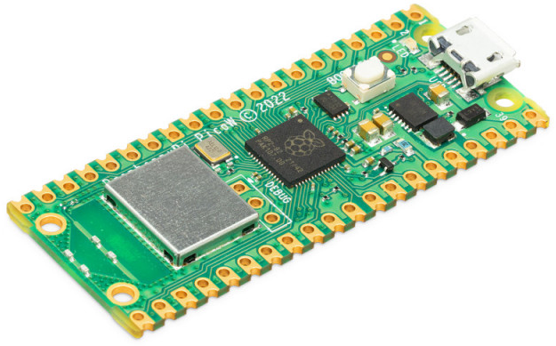

## Flashing the firmware

The first step to get this working is to flash the Raspberry Pi Pico W with the
MicroPython firmware. It is possible to use C and probably other programming
languages (Rust would be cool), but for something this simple, Python is a good
choice to me.

To download the firmware, visit https://rpf.io/pico-w-firmware. At the time of
writing, this goes to `rp2-pico-w-20220919-unstable-v1.19.1-437-g13c4470fd.uf2`.

To flash the Pi Pico with the UF2 firmware file, disconnect it from the computer
(if you've already plugged it in) and reconnect it while holding the BOOTSEL
button on it. It is the only button on the Pi Pico.

It should should up as a USB mass storage device named `RPI-RP2`. Drag and drop
the UF2 file on it and wait for the file transfer to complete. The Pi Pico will
self-disconnect after.

At this point the Pi Pico W is ready to accept programs to run while powered on.
I use the Thonny IDE as it has built-in support for flashing the programs onto
the Pi Pico W.

## Testing out MicroPython

To make sure MicroPython works as expected, start up Thonny and in the bottom
right corner, make sure *MicroPython (Raspberry Pi Pico)* is selected. If it
doesn't show up, try flashing the board again. If it does show up, but Thonny
prints out an error in the Shell pane and the Run and Debug buttons are greyed
out, switch to *Local Python 3* and back to *MicroPython (Raspberry Pi Pico)*.
This should make the Thonny Pi Pico W connection work and allow you to program
the board.

Next up, go to Tools > Manage Packages in Thonny and install `picozero`. This
package makes it super easy to access the built-in LED and the CPU temperature
reading.

Next up, use this program to validate your ability to upload a program to the Pi
Pico W as well as its ability to connect to a 2.4GHz wireless network.

```python
import network
import socket
from time import sleep
from picozero import pico_temp_sensor, pico_led
import machine

ssid = 'ssid'
password = 'password'

wlan = network.WLAN(network.STA_IF)
wlan.active(True)
wlan.connect(ssid, password)
while wlan.isconnected() == False:
    print('Waiting for connection...')
    pico_led.off()
    sleep(1)
    pico_led.on()

print(pico_temp_sensor.temp)
```

This program will flash the on-board LED while the Pi Pico W is attempting to
connect to the wi-fi network and finally keep the LED lit and print the current
CPU temperature to the Shell pane.

When re-deploying the program using the Run button, it seems Thonny/MicroPython
are able to do some sort of hot-reloading or maybe the wi-fi chip stays in the
connected state as long as the board is powered on even while the new versions
of the program are uploaded onto the Pi, so the connection loop will only happen
the first time or after disconnecting and reconnecting the board.

This program is taken from this Pi Pico W site project and cut down a bit:
https://projects.raspberrypi.org/en/projects/get-started-pico-w/0

The Thonny program can stay unsaved, or you can save it on your local drive (but
then it won't be on the Pico W once it restarts) or you can save it on the Pico
W as a file named `main.py` to make the program start up whenever the Pi Pico W
is powered up.

## Setting up the database

I am using Supabase to get a fully-fledged, hosted Postgres instance. On there,
go to the dashboard and create a new project in your organization. I named it
after this repo, `pi-pico-rest-cpu-temp`. Take note of the Supabase database
password, it will be needed later when we set up the Deno function.

In the project, go to the database editor and create a table to collect the
data. I am keeping the default columns (`id`, `created_at`) and adding columns
`recorded_at` (this will be very close temporally to `created_at` but not the
same as it will take some time for the function to write to the database) and
`temperature`. I have also made `created_at` non-nullable. The temperature is
stored as a `float4` numeric type.

With the database set up, it is time to test out connecting to it and writing
some data to it by hand. I am using Postico as a GUI Postgres client to connect
to the backing Postgres database. In Supabase, go to project settings, Database
and find the Host value. That goes to the Host field of the Postico connection.
User is `postgres` and the password is the one chosen while setting up the DB.

https://eggerapps.at/postico

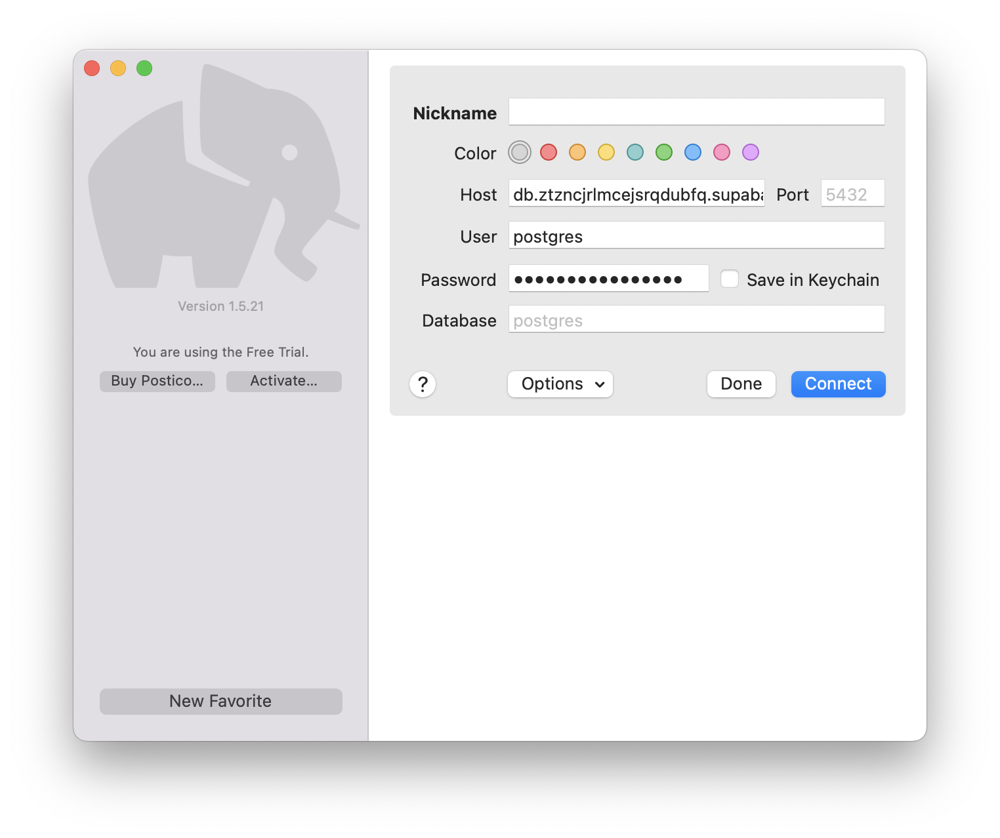

On the initial connection, Postico will ask you whether you trust the host
certificate:

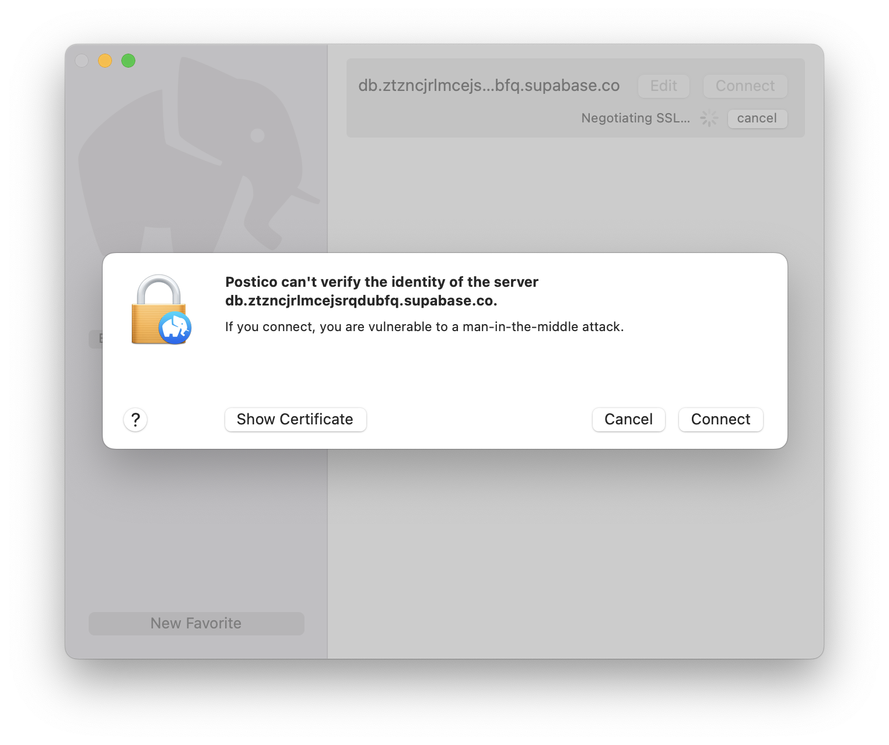

Afterwards, the SQL window in Postico can be used to query the database:

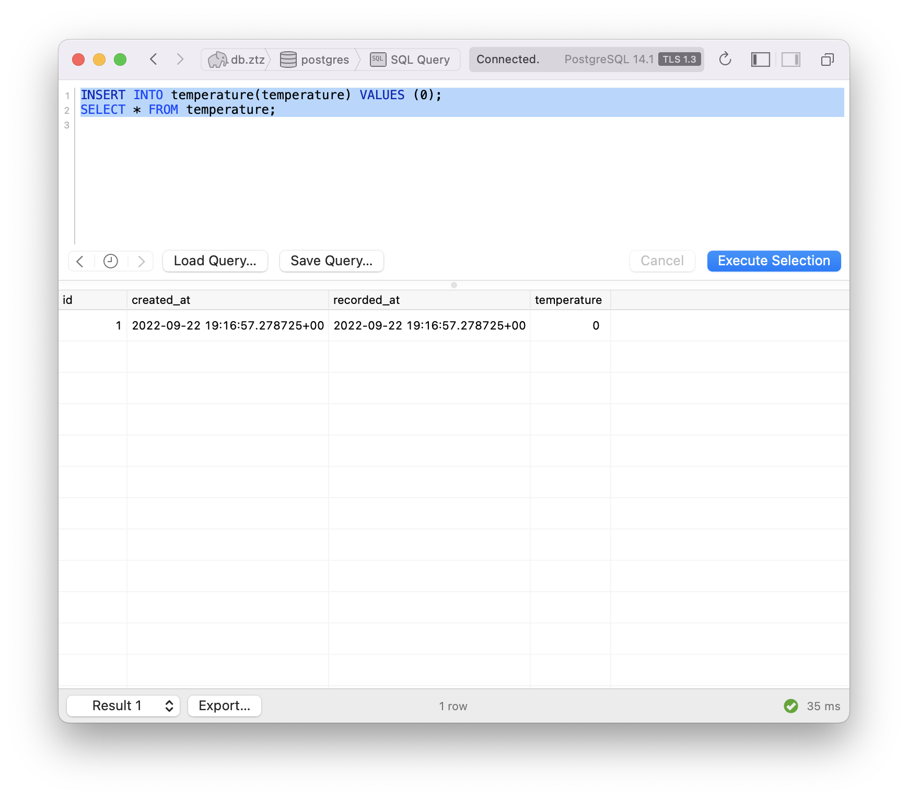

Another way of talking to the database is to use the `psql` CLI tool. It comes
with Postgres itself. My favorite way of installing Postgres or just its bundled
utilities (like `psql`) on macOS is the Postgres app: https://postgresapp.com.

You don't have to install Postgres locally just to use `psql`. Install the
Postgres app, but do not set up a database. Instead, find the path to the `psql`
utility in the Postgres app bundle. Something like this:

`/Applications/Postgres.app/Contents/Versions/14/bin/psql`

You can add it to your shell's path to be able to invoke it using only `psql`. I
don't like to do it but for brevity I will refer to it just by the file name for
the rest of this document.

To connect to a Supabase database, a command like this can be issued:

```sh
psql -h db.ztzncjrlmcejsrqdubfq.supabase.co -p 5432 -d postgres -U postgres
```

`db.ztzncjrlmcejsrqdubfq.supabase.co` is the Host value in project settings in
Supabase, in the Database section. `-d` and `-U` are database and user names.

 - [ ] Eliminate the options here which are defaults and can be omitted

`psql` is an interactive utility. Run it and you'll be presented with a prompt
for a password. To provide a password on the CLI, set the `PGPASSWORD` env var.

Once in `psql`, SQL commands may be entered. They will execute once terminated
with a semicolon. This allows easy authoring of multi-line commands. Use the
`exit` command to leave the utility.

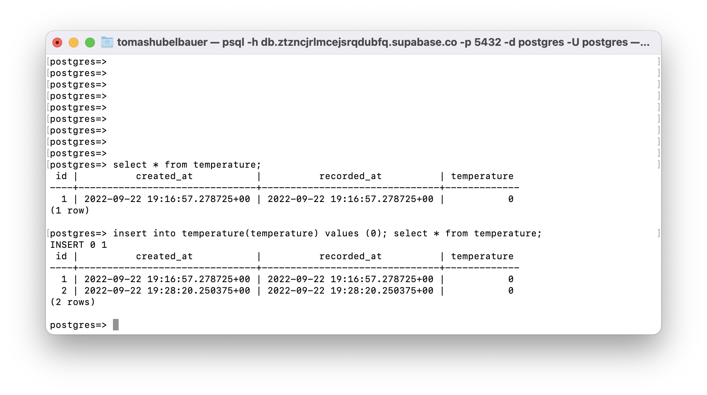

## Setting up the function

For the endpoint that I will want my Pi Pico W to send the data to, I will use
a serverless function option from Deno. Deno provides a service called Deno
Deploy which allows to easily host edge functions that can connect to Postgres
with help of additional modules.

Deno Deploy operates based on a GitHub repository from which it pulls the file
to use as the code for the function. Functions are authored in TypeScript. I
will call mine [`function.ts`](function.ts) and place it alongside this readme.

Again, I will call the Deno project by the name of this repository. Deno uses
GitHub to connect and it is best to install it in a way where it only has access
to the desired repository:

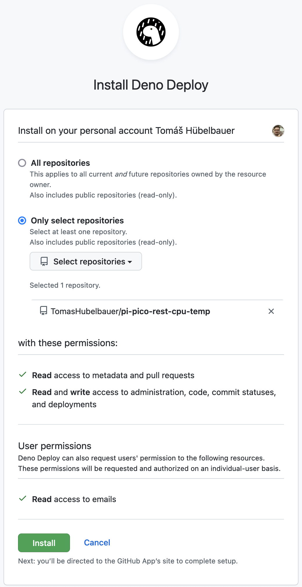

In Deno, only that repository will then be available:

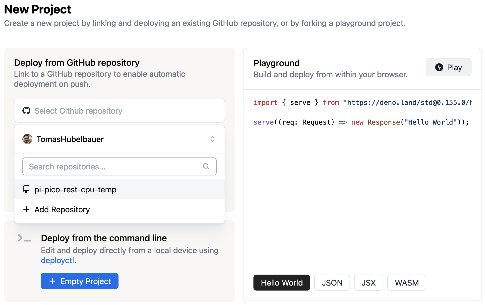

We also want to make use of the Automatic mode which installs a webhook to watch
for pushes to the repository and redeploys the function after each one.

The GitHub Action mode is much more flexible in terms of allowing for a build
step, but we don't need that here.

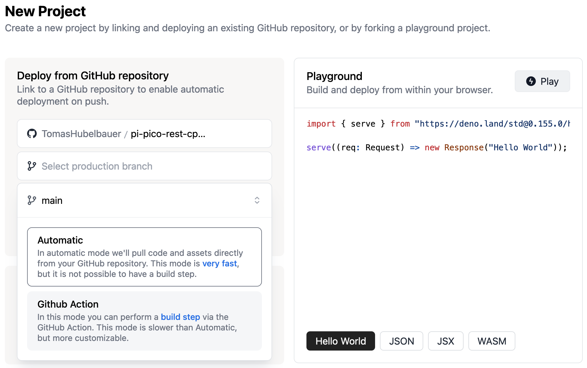

I named the function `pi-pico-rest-cpu-temp` like all the other things and now
it lives on this URL:

https://pi-pico-rest-cpu-temp.deno.dev

The most basic hello world function looks like this:

```typescript
import { serve } from "https://deno.land/std@0.140.0/http/server.ts";

serve((_req) => {
  return new Response("Hello World!", {
    headers: { "content-type": "text/plain" },
  });
});
```

To call it, access the URL above and see the response in the browser.

We'll want it to talk to Postgres so we need to bring that in as a module. Lucky
for us that's something that the Deno docs cover:
https://deno.com/deploy/docs/tutorial-postgres

For this script, we will need to know the connection string to use to connect to
the database. We could use a user name and a password, but the connection string
is a more compact way to containing the connection instructions. You can find it
on Supabase, in the project settings, Database tab under the section Connection
String. It's best to switch to the URI tab there.

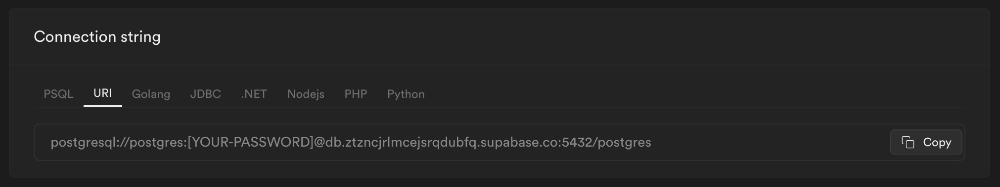

Substitute the database password there and store that final connection string in
Deno environment variables, something like this:

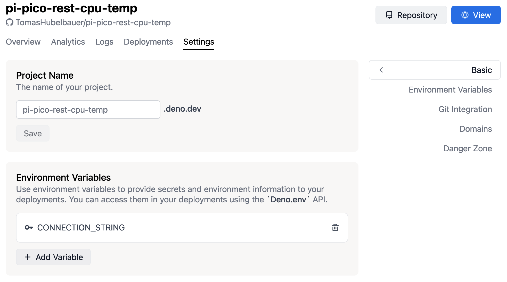

With this done, the code can access the connection string and we can connect to
Postgres and use the database data as a part of the request-response flow.

```typescript
import { serve } from "https://deno.land/std@0.140.0/http/server.ts";
import * as postgres from "https://deno.land/x/postgres@v0.14.0/mod.ts";

// Pull the database connection string from the Deno environment variables
const connectionString = Deno.env.get("CONNECTION_STRING")!;

// Set up a connection pool with a single lazy connection
const pool = new postgres.Pool(connectionString, 1, true);

serve(async request => {
  const connection = await pool.connect();
  try {
    const data = await connection.queryObject`SELECT * FROM temperature`;
    console.log(data);
    return new Response("Success: " + data.rowCount + " rows", {
      headers: { "content-type": "text/plain" },
    });
  }
  catch (error) {
    return new Response("Error: " + error.message, {
      headers: { "content-type": "text/plain" },
    });
  }
  finally {
    connection.release();
  }
});
```

This code allows the caller to connect, retrieves all available rows and returns
the number of rows in the database.

## Testing out the function

We want to call this endpoint using the POST method with a JSON payload, so from
now on we need more to test it than mere URL access in the browser.

To call this function using POST with JSON, let's reach for cURL in shell:

```bash
# Note that `-H` is for `--header` and `-d` for `--data` and it impliest POST
curl -H "Content-Type: application/json" -d '{"temperature":0}' https://pi-pico-rest-cpu-temp.deno.dev
```

## Persisting the values

The final code looks like this:

```typescript
import { serve } from "https://deno.land/std@0.140.0/http/server.ts";
import * as postgres from "https://deno.land/x/postgres@v0.14.0/mod.ts";

const CONNECTION_STRING = Deno.env.get("CONNECTION_STRING")!;
const SECRET = Deno.env.get("SECRET")!;

serve(async request => {
  const client = new postgres.Client(CONNECTION_STRING);
  
  try {
    await client.connect();
    
    const { secret, temperature } = await request.json();
    
    if (secret !== SECRET) {
      throw new Error('Invalid secret!');
    }
    
    if (isNaN(Number(temperature))) {
      throw new Error('Invalid temperature!');
    }

    const data = await client.queryObject`INSERT INTO temperature(temperature, recorded_at) VALUES (${temperature}, ${new Date()})`;
    console.log(data);
    
    return new Response("Success: " + data.rowCount);
  }
  catch (error) {
    return new Response("Error: " + error.message ?? error);
  }
  finally {
    await client.end();
  }
});
```

We receive the call, we parse the body as a JSON, we check for a secret to
authorize the caller (the secret is another Deno environment variable) and we
call the Supabase Postgres instance with an `INSERT` query providing the data
as arguments to a template string function which does SQL injection prevention
and type marshalling.

I've also switched to the `Client` API, this endpoint won't ever be legitimately
called in parallel so it is more than sufficient.

Supabase is getting filled with data okay so this is good to go!

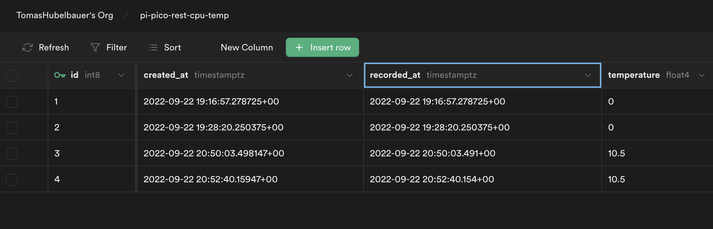

## Constructing the call

Back in the board, in MicroPython, we need to craft the same request we have
been sending to the Deno edge function using cURL until now.

```bash
curl -H "Content-Type: application/json" -d '{"temperature":…,"secret":…}' https://pi-pico-rest-cpu-temp.deno.dev
```

In order to make this call from Python, the `urequests` PiPy module can be used.
Use Thonny to install it and also install `ujson` for constructing the payload.

This documentation page show how that might look like:
https://makeblock-micropython-api.readthedocs.io/en/latest/public_library/Third-party-libraries/urequests.html#sample-code-3

```python
headers = { 'content-type': 'application/json' }
data = ujson.dumps({ "temperature": 0, "secret": "TODO" })
response = requests.post('https://pi-pico-rest-cpu-temp.deno.dev', headers, data)
print(response.text)
```

## Recap & To-Do

So far in this guide I've covered:

- [x] Flash the Pi Pico with the MicroPython firmware
- [x] Test out the MicroPython firmare and learn to use Thonny
- [x] Set up a Supabase database for storing the readings
- [ ] Set up a Deno function for persisting the readings

This is currently in the queue/in the works:

- [ ] Make the POST call with a JSON payload

In order to finalize the implementation of the stated purpose at the top of the
readme, this is what's left to do:

- [ ] Run the program on in a loop to collect readings over time
- [ ] Measure power draw over a period of time for comparison
- [ ] Implement wi-fi sleep mode for power saving
- [ ] Compare power draw with the sleep mode on
- [ ] Implement wi-fi disconnect and reconnect as an alternative to wi-fi sleep
- [ ] Compare power draw with the other two solutions
